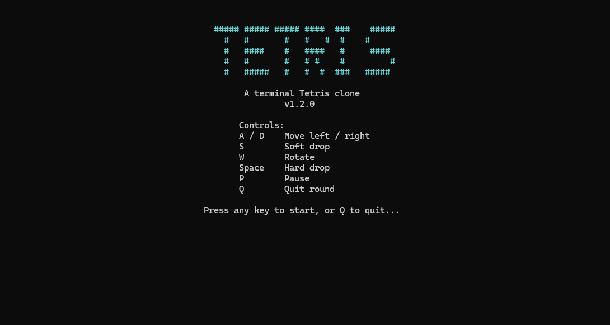
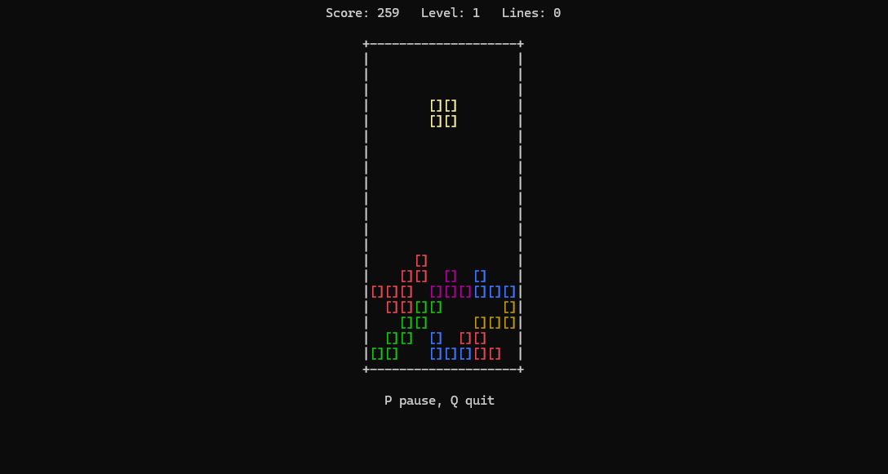

# tetris-c

A classic Tetris clone written in plain C, rendered entirely in the terminal. Built with CMake, no external libraries required.


**[Download the latest release ↓](https://github.com/muhmol/tetris-c/releases/latest)**

---

## Screenshots

<!--
  Add your screenshots here. Suggested steps:
  1. Take a screenshot of the start screen and one of active gameplay (Win+Shift+S on Windows).
  2. Save them into a folder called `screenshots/` at the repo root, e.g.
     screenshots/start-screen.png
     screenshots/gameplay.png
  3. The table below already references those paths — once the files exist, they'll render automatically.
  4. Delete this comment block once your screenshots are in place.
-->

| Start screen | Gameplay |
|---|---|
|  |  |

## Features

- All 7 tetrominoes (I, O, T, S, Z, J, L) with 4-directional rotation, computed on the fly from a single base shape per piece — no pre-rotated grids stored.
- Full collision detection: wall bounds, floor, and stacked pieces.
- Line clearing with classic scoring (single / double / triple / tetris), scaled by level.
- Level progression: every 10 lines cleared increases the level and speeds up gravity.
- Colored pieces in the terminal, matched to each tetromino type.
- Title screen with ASCII art, aligned controls reference, and the current version number, shown once on launch.
- Pause (`P`) — freezes the board without disrupting gravity timing, so resuming doesn't cause a sudden fast drop.
- Quit confirmation — pressing `Q` mid-game asks before ending the round and returns you to the start menu rather than closing the program outright; the start menu itself also confirms before actually exiting.
- Board, start screen, and all prompts are centered in the console window, and re-center automatically if the window is resized.
- Play-again prompt after game over — no need to relaunch the exe between rounds.
- Single statically-linked executable. No installer, no MSYS2/MinGW runtime needed on the machine you run it on.

## Controls

| Key     | Action       |
|---------|--------------|
| `A`     | Move left    |
| `D`     | Move right   |
| `S`     | Soft drop    |
| `W`     | Rotate       |
| `Space` | Hard drop    |
| `P`     | Pause / resume |
| `Q`     | Quit (asks for confirmation) |

Pausing freezes the board and replaces the controls line with `PAUSED - press P to resume`; press `P` again to resume exactly where you left off — gravity timing is preserved across the pause so you won't get a sudden fast drop when you unpause.

Pressing `Q` during a round asks `Quit to menu? (Y/N)`. Answering `N` resumes play immediately (even if the game was already paused); answering `Y` ends the round and returns you to the start menu, from which you can start a new game or quit the program entirely (also with a confirmation).

When a round ends by topping out, you'll be asked `Play again? (Y/N)` — press `Y` to start a fresh board or `N` to exit.

## Scoring

| Lines cleared at once | Points (× level) |
|------------------------|------------------|
| 1 (single)              | 100 |
| 2 (double)              | 300 |
| 3 (triple)              | 500 |
| 4 (tetris)              | 800 |

Soft drop awards 1 point per cell dropped; hard drop awards 2 points per cell. Level increases every 10 total lines cleared, and gravity speed scales up with level (capped at a minimum delay of 100ms per row).

## Download & run

No build tools needed — grab the prebuilt executable:

1. Go to [Releases](https://github.com/muhmol/tetris-c/releases/latest)
2. Download `tetris.exe`
3. Double-click it — it opens directly into a console window, ready to play

The executable is statically linked, so it runs on any up-to-date Windows 10 or 11 machine with no additional runtime installed.

## Building from source

### Requirements

- CMake 3.20+
- A C compiler with C17 support — this project is developed and tested against MinGW-w64 GCC (via [MSYS2](https://www.msys2.org/), `ucrt64` environment)
- Windows (the input/rendering code uses `<windows.h>` and `<conio.h>`, so this currently does not build on Linux/macOS as-is)

### Build

```bash
git clone https://github.com/muhmol/tetris-c.git
cd tetris-c
cmake -S . -B build
cmake --build build
```

### Run

```bash
./build/tetris.exe
```

## Project structure

```
tetris-c/
├── src/
│   └── main.c          # entire game: board, pieces, input, rendering, scoring
├── CMakeLists.txt       # build configuration, statically links the runtime
├── .gitignore
└── README.md
```

The whole game intentionally lives in a single `main.c` — there's no game engine or external dependency, just the C standard library plus the Windows console API for input and color.

## How it works, briefly

- **Board**: a `10 × 22` grid, where the top 2 rows are hidden and only used as spawn/rotation headroom for new pieces.
- **Pieces**: each tetromino is stored once, in its spawn orientation, as a `4×4` grid of 0s and 1s. Rotations aren't pre-stored — `getCell()` rotates the requested cell mathematically on each lookup, so all 4 rotations of all 7 pieces come from just 7 arrays total.
- **Gravity & input**: the main loop polls the keyboard every frame (non-blocking, via `_kbhit()`/`_getch()`) and separately checks elapsed time to decide when the current piece should fall one row, so movement feels responsive independent of fall speed.
- **Locking & clearing**: when a piece can no longer fall, its cells are written permanently into the board array, then every row is checked for completeness; full rows are removed and everything above shifts down.
- **Version display**: the version shown on the start screen isn't hardcoded in `main.c` — it's defined once as `APP_VERSION` in `CMakeLists.txt` and passed into the code at compile time via a preprocessor definition, so bumping the version for a new release means changing exactly one line.
- **Confirmation prompts**: `Q` and the start menu's quit option both route through a small `confirmPrompt()` helper that temporarily overrides the board's status line to ask `Y/N`, rather than printing a separate line — this keeps every prompt visually anchored to the board with no leftover text once it's dismissed.

## Roadmap / ideas for contributing

These aren't implemented yet — pull requests welcome:

- [ ] Next-piece preview panel
- [ ] Hold piece
- [ ] Proper SRS wall-kick rotation (current rotation is naive — it fails near walls/other pieces where a real Tetris would nudge the piece to fit)
- [ ] Persistent high score saved to a file
- [ ] Cross-platform input handling (replace `conio.h`/`windows.h` with a portable alternative, e.g. `ncurses` on Linux/macOS)

## License

MIT — see [LICENSE](LICENSE) for details.
